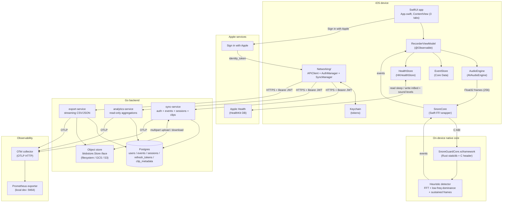
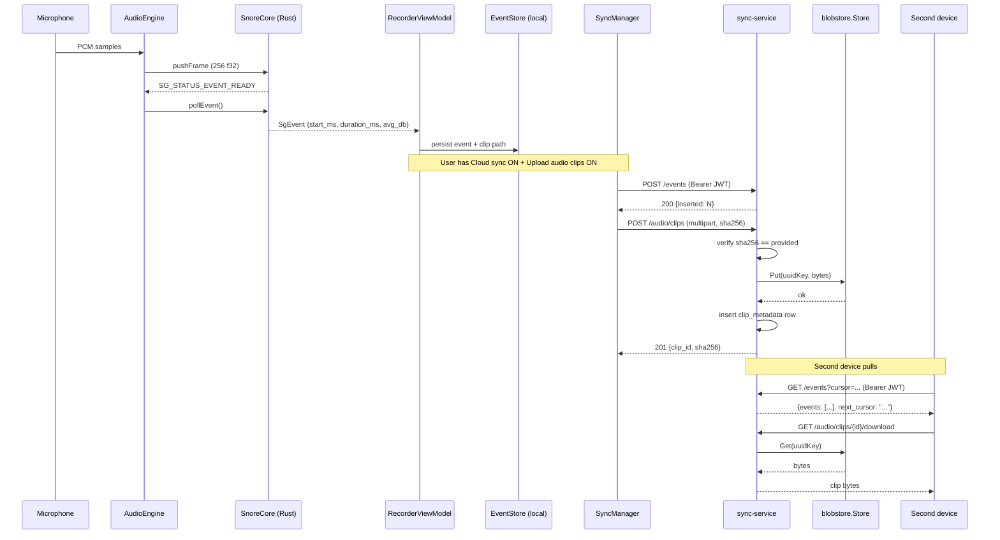

# SnoreGuard architecture

SnoreGuard is an end-to-end mobile platform for tracking snore-like events
during sleep. It is **not a medical device** and does not provide
diagnostic output. Detection runs on-device using a deterministic Rust
heuristic; an opt-in Go backend offers cloud sync, multi-device history,
optional raw audio clip storage, and analytics export. The platform is
designed so the iOS app remains fully functional offline — the backend is
a strict superset, never a dependency.

---

## Top-level system diagram

---

## iOS app architecture

The iOS app is SwiftUI-first, targeting iOS 17+. It is composed of:

- `App.swift` — `@main` entry point. Owns the root `ContentView` and the
  app-wide environment objects (auth manager, network client, event store).
- `ContentView` — three-tab `TabView`: **Record**, **Insights**, **Settings**.
- `RecorderViewModel` — `@Observable` view model that owns recording
  lifecycle (start/stop), publishes live volume + event counters, and
  forwards finalized events to `EventStore`.
- `AudioEngine` — wraps `AVAudioEngine` + `AVAudioSession`. Configures
  `.playAndRecord` with `.mixWithOthers + .allowBluetoothA2DP +
  .defaultToSpeaker`. Taps `inputNode`, downsamples to mono 16 kHz Float32
  via `AVAudioConverter`, and pushes 256-sample frames into `SnoreCore`.
- `SnoreCore` — Swift FFI wrapper around `SnoreGuardCore.xcframework`.
  Owns the opaque `OpaquePointer` to the Rust detector and frees it in
  `deinit`. Exposes `pushFrame(_:)` and `pollEvent()`.
- `EventStore` — Core Data persistence layer for sessions and events.
  Stores per-event metadata (start time, duration, average dB-ish
  intensity, session id) and per-session metadata.
- `HealthStore` — `HKHealthStore` wrapper. Three-toggle authorization
  surface: read sleep stages, write sessions as `inBed`, write estimated
  sound levels as `environmentalAudioExposure` with uncalibrated metadata.
- `Networking/`:
  - `APIClient` — `URLSession`-backed transport with `URLProtocol` mock
    point for tests.
  - `AuthManager` — Sign-in-with-Apple flow + `Keychain` token storage
    (access + refresh) + automatic refresh-on-401.
  - `SyncManager` — pushes new sessions, events, and audio clips to the
    backend; pulls remote changes via cursor pagination on second devices.

The Record tab does live recording. The Insights tab shows per-day and
per-week aggregates and a clip review list. Settings holds the three
HealthKit toggles, the cloud-sync toggle, the audio-upload toggle, the
threshold slider, the sensitivity picker, and the disclaimer link.

---

## Rust detector core

The detector is a self-contained Cargo crate (`rust-core/snoreguard-core`)
built as a `staticlib` and packaged into `SnoreGuardCore.xcframework` for
iOS device + simulator slices. Algorithm:

1. Push exactly 256 Float32 samples per frame (16 kHz mono).
2. Real FFT via `rustfft`; derive an uncalibrated dB-ish value in
   `[30, 100]`.
3. Compare lower 1/4 spectrum energy to upper 3/4 — ratio threshold is
   sensitivity-dependent (`Low = 2.0×`, `Medium = 1.5×`, `High = 1.2×`).
4. Mark a frame snore-like when dB > threshold AND low-frequency
   dominance holds.
5. Emit an event when the snore-like condition holds for
   `DEFAULT_SUSTAIN_FRAMES = 15` consecutive frames.

The C ABI is opaque-pointer + integer status codes (`SG_STATUS_OK`,
`SG_STATUS_EVENT_READY`, etc). The detector is single-threaded — confine
all calls to the audio render thread, or serialize via a queue. The same
crate compiles on Mac and Linux for `cargo test`, so the heuristic is
covered by unit + property + FFI lifecycle tests in CI on Linux runners
without needing a Mac.

---

## Go backend services

Single Go module, three binaries.

| Service | Port | Responsibility |
|---|---|---|
| `sync-service` | `:8080` | Apple Sign-In, refresh tokens, event ingest + cursor list, recording session metadata, audio clip multipart upload + soft-delete |
| `analytics-service` | `:8081` | Read-only per-day rollups + all-time totals (filtered by JWT user) |
| `export-service` | `:8082` | Streaming CSV/JSON history export + per-clip download URLs |

Shared internal packages: `apple` (identity-token verification with
`RS256`/`ES256` allowlist), `auth` (bearer-token middleware + `UserIDFrom`
context helper), `jwt` (HS256 access-token issue/verify), `store`
(`pgx`-backed Postgres for users / events / sessions / refresh tokens /
clip metadata), `httpkit` (JSON helpers), `otel` (env-driven OTLP setup),
`config` (env parsing), `metrics` (counters + histograms), `blobstore`
(object-storage abstraction — see ADR 0008), `migrations` (embed.FS
runner + checksum verification).

Refresh tokens rotate on every `/auth/refresh`. Reusing a previously
rotated token revokes the entire `family_id` (theft response). Logout
revokes both the access JTI and the refresh family.

Cursor pagination uses a compound `(received_at, id)` cursor so
same-timestamp batches don't silently truncate. The same cursor threads
through export streaming.

Per-IP rate limiting and per-user export budgets bound abuse.

---

## HealthKit integration

Three independent opt-in toggles in Settings (per ADR 0004):

1. **Read sleep stages** — `HKCategoryType(.sleepAnalysis)` read scope.
   Used only to overlay sleep-stage shading in the Insights tab; never
   uploaded; never used to infer REM / core / deep stages from the
   microphone signal.
2. **Write sessions as `inBed`** — writes each recording session as an
   `HKCategorySample` of `.inBed` with start/end times.
3. **Write estimated sound levels as `environmentalAudioExposure`** —
   writes each session's average uncalibrated sound level as an
   `HKQuantitySample` with metadata flags marking the source as
   uncalibrated and the device as a consumer-grade microphone.

Each toggle drives a separate `HKHealthStore.requestAuthorization` call
on first enable. The toggle UI reflects the real authorization status, not
just a local boolean. The user can revoke any toggle at any time from
iOS Settings → Health → Data Access & Devices → SnoreGuard.

---

## Cloud sync model

Cloud sync is a **single user-facing toggle** in Settings, off by default.
When enabled:

- New recording sessions and snore-like events are pushed via
  `POST /events` (idempotent on `client_event_id`) and the corresponding
  session-create endpoint.
- A second device on the same Apple account pulls the same data via
  `GET /events?cursor=...` using the compound cursor.
- All local data continues to work offline; sync resumes when the network
  returns.

What is **not** synced under this toggle: HealthKit sleep-stage reads
(those stay in Apple Health, not in SnoreGuard's backend), and raw audio
clips (those need a separate toggle).

---

## Raw audio upload

A second, independent toggle: **Upload audio clips**. Off by default,
visible only when cloud sync is on. When both are on:

- Short clips around detected events are uploaded via multipart POST.
- Each upload includes a sha256 of the clip bytes; the backend verifies
  the hash before persisting to the object store.
- Clips are stored under opaque UUID-based keys in the configured
  blobstore backend (filesystem / GCS / S3-compatible).
- Clip metadata (id, session id, start time, duration, sha256, byte
  length, content type) is stored in Postgres separately from the bytes.
- Soft-delete via `DELETE /audio/clips/{id}` marks the metadata row
  deleted and removes the underlying object.

Continuous all-night raw audio is **never** uploaded — only the short
clips that the on-device detector flags.

---

## Telemetry

OpenTelemetry, OTLP HTTP transport, env-driven via the standard
`OTEL_EXPORTER_OTLP_*` variables. A local docker-compose profile ships an
OTel collector that prints traces + metrics to stdout via the `debug`
exporter and exposes a Prometheus scrape endpoint at `:9464`.

Span attributes follow OpenTelemetry semantic conventions
(`http.route`, `http.response.status_code`, custom `endpoint` for
handler-level routing). User identifiers are always exported as
`user_id_hash` (`sha256(uid)[:8]`) — **never** the raw UUID, **never**
the email, **never** the Apple `sub`.

Logging is structured JSON via `slog`. Log level via `LOG_LEVEL`. Raw
audio bytes, clip filenames, tokens, and emails are never logged.

---

## Export

`export-service` streams CSV or JSON. Streams paginate internally in
500-row pages so memory stays flat for multi-month exports. Output
includes per-event metadata and per-clip metadata (id, sha256, byte
length). Binary clip bytes are downloaded out-of-band via
`GET /audio/clips/{id}/download`. Exports are filtered to the
authenticated user; cross-user reads are tested.

A per-user export budget per 24-hour window bounds export abuse.

---

## Deployment topology

**Local dev** (Docker Compose):

- Postgres
- `sync-service` + `analytics-service` + `export-service`
- OTel collector (debug exporter to stdout + Prometheus on `:9464`)
- Filesystem blobstore (mount-backed directory)

**Staging / production**:

- Managed Postgres (Cloud SQL / RDS / equivalent)
- Object store: GCS or S3-compatible (R2, MinIO, S3) — selected at deploy
  time per ADR 0008
- Container runtime: any ECS-class platform (Cloud Run, Fly.io, ECS,
  Nomad, K8s)
- TLS via reverse proxy (Caddy auto-Let's-Encrypt or vendor LB)
- OTel destination: Tempo / Mimir / vendor (Honeycomb, Datadog, etc)
- Database migrations applied automatically on startup; checksum-tracked

See [`DEPLOYMENT.md`](DEPLOYMENT.md) for the full matrix.

---

## Trust boundaries

| Boundary | Form | Mitigation |
|---|---|---|
| Device user ↔ device OS | iOS sandbox | Tokens in Keychain (`AfterFirstUnlockThisDeviceOnly`); microphone usage strings |
| Device app ↔ backend | TLS over HTTPS | Bearer JWT with HS256 + access-token revocation list (`revoked_jti`) |
| iOS app ↔ HealthKit | System-mediated authorization | Three independent opt-in toggles; uncalibrated metadata; never-infer-stages-from-microphone rule |
| Backend ↔ Postgres | Network (private VPC in prod) | Connection pooling via `pgx`; least-privilege DB user; query parameterization |
| Backend ↔ object store | Auth-mediated | Opaque UUID keys; per-clip sha256 verification; soft-delete metadata before object delete; signed URLs or proxied download |
| Apple identity service ↔ backend | Apple-issued JWT | Algorithm allowlist (`RS256`/`ES256` only); audience check (`APPLE_AUDIENCE`); short Apple-token TTL |

See [`THREAT_MODEL.md`](THREAT_MODEL.md) for the full threat model.

---

## Cloud-sync sequence

